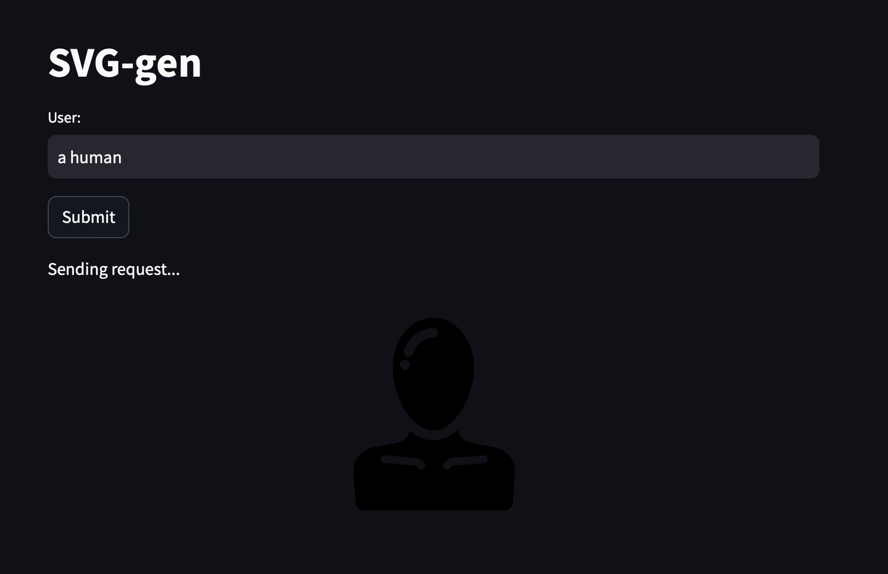

# SVG-Gen: Generate SVGs with LLMs
SVG-Gen is a tool that leverages the power of large language models (LLMs) and Retrieval-Augmented Generation (RAG) to generate and customize SVG icons based on simple user prompts. This project was developed as a winning entry in the Cohere RAG Hackathon.

## Inspiration
Are you a designer struggling to find the perfect SVG icons in tools like Figma or Adobe Illustrator? Do you find these tools cumbersome for creating custom icons? SVG-Gen aims to simplify this process by using AI to generate and customize SVGs effortlessly. Notably, existing models, including GPT-4-turbo, have limitations in generating basic SVGs, which motivated us to develop a more effective solution.

## How It Works
SVG-Gen uses a combination of Cohere's embedding and chat APIs along with a large dataset of SVG files to provide a seamless experience for generating and customizing SVGs.

### Retrieval-Augmented Generation (RAG)
1. **Embedding**: We embedded 300,000 SVG files using Cohere's embedding API to create a comprehensive vector store.
2. **User Prompt**: Given a user prompt, such as "bed with a green frame," the system retrieves relevant SVGs from the vector store.
3. **Customization**: The retrieved SVGs can be customized according to the user's specifications, including color and other attributes.
4. **Attribution**: The system identifies the original icon library for proper attribution and licensing.
### Technology Stack
1. **Frontend**: Built with Streamlit for a user-friendly interface.
2. **Vector Store**: Utilized hnswlib for efficient nearest neighbor search within the SVG embeddings.
3. **APIs**: Integrated Cohere's chat and embedding APIs for generating and customizing SVGs.
### Limitations
1. **Preliminary State**: The current codebase is in a preliminary state, primarily serving as a tech demo.
2. **Context Size**: Due to the context size limitations of the Cohere APIs, the number of SVGs that can be mixed and matched is limited. A larger context window could significantly enhance performance.

## Demo 

## Usage
To load your own SVG library, check out the directory.py file. The code is provided as-is, with opportunities for further expansion and refinement.

## References
Inspired by the need for better SVG generation tools, SVG-Gen builds on existing technologies to offer a more intuitive and customizable experience for designers.

## Getting Started
To get started with SVG-Gen, follow these steps:

1. Clone the repository.
2. Install the required dependencies.
3. Run the Streamlit application to start generating and customizing your SVGs.
4. To load your own svg library, check out the `directory.py` file.

To load your own svg library, check out the `directory.py` file.

Due to the context size limitations of the cohere apis, we are limited as to how many svgs we can mix and match (and with what level of detail). We believe running this same technique with a larger context window can dramatically improve the performance.
